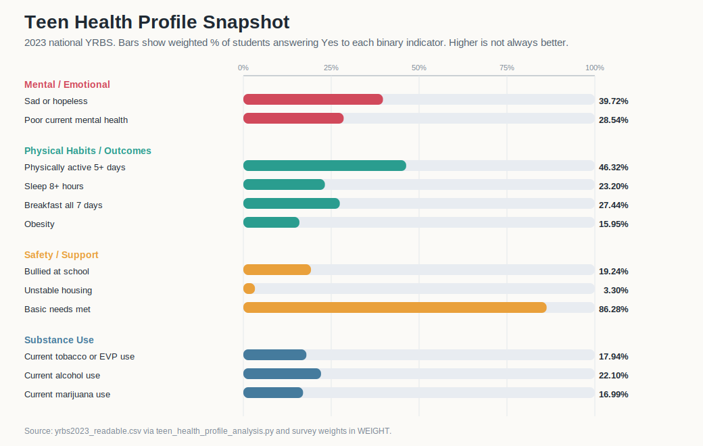

# Project of Data Visualization (COM-480)

| Student's name | SCIPER |
| -------------- | ------ |
|Rui Yang | 294952 |
|Shuli Cécile Jia | 316620 |
|Christos Konstantinidis | 347437 |

[Milestone 1](#milestone-1) • [Milestone 2](#milestone-2) • [Milestone 3](#milestone-3)

## Milestone 1 (20th March, 5pm)

**10% of the final grade**

This is a preliminary milestone to let you set up goals for your final project and assess the feasibility of your ideas.
Please, fill the following sections about your project.

*(max. 2000 characters per section)*

### Dataset

> Find a dataset (or multiple) that you will explore. Assess the quality of the data it contains and how much preprocessing / data-cleaning it will require before tackling visualization. We recommend using a standard dataset as this course is not about scraping nor data processing.
>
> Hint: some good pointers for finding quality publicly available datasets ([Google dataset search](https://datasetsearch.research.google.com/), [Kaggle](https://www.kaggle.com/datasets), [OpenSwissData](https://opendata.swiss/en/), [SNAP](https://snap.stanford.edu/data/) and [FiveThirtyEight](https://data.fivethirtyeight.com/)).

We will use the 2023 national Youth Risk Behavior Survey (YRBS) from the CDC as our first dataset for Milestone 1. YRBS is a standardized, school-based survey of U.S. high school students and is well documented, making it well suited for a data visualization project. We converted the official ASCII release into a readable CSV format, resulting in a dataset of 20,103 students and 250 variables.

The data quality is high, as the CDC provides the survey instrument, variable labels, derived indicators, and weights. Preprocessing was limited to format conversion and preserving the codebook. YRBS is particularly valuable because it covers multiple dimensions of adolescent health, including mental health, sleep, physical activity, nutrition, substance use, and school environment in a consistent format.

As a second dataset, we use the Social Media Addiction vs Relationships dataset by Adil Shamim (Kaggle, CC BY 4.0). It contains about 700 students aged 18–24 across 110 countries, with 13 variables covering demographics, daily usage, sleep, mental health, and addiction scores.

We also include the Teen Phone Addiction dataset from Kaggle, which focuses specifically on smartphone use and its relationship to lifestyle and wellbeing. It includes variables such as daily usage, social media time, sleep, anxiety, depression, academic performance, and addiction level, making it well suited for analyzing links between digital behavior and health.

The Kaggle datasets are suitable for exploratory analysis. They contain no missing values or duplicates and are generally well balanced, though some age concentration is present. However, as self-reported, non-probabilistic surveys, results should be interpreted cautiously.

### Problematic

> Frame the general topic of your visualization and the main axis that you want to develop.
> - What am I trying to show with my visualization?
> - Think of an overview for the project, your motivation, and the target audience.

Our project aims to understand adolescent health in general, including both mental and physical health. We want to build a visual teen health profile from YRBS that combines mental and emotional wellbeing, physical habits and outcomes, safety and support conditions, and substance use, then show how those patterns vary across subgroups such as sex, grade, and race/ethnicity.

The motivation is that public discussion about teenagers often isolates one issue at a time, while the survey itself captures a much broader health picture. We want to turn that breadth into an interpretable visual story: where the strongest challenges sit, which protective behaviors are less common than expected, and which subgroup gaps deserve attention. Our target audience is broad: classmates, instructors, and general readers interested in youth well-being, education, or public health. The goal is explanatory and exploratory rather than causal. We do not aim to prove why these patterns exist; we aim to communicate the shape and distribution of adolescent health indicators visible in this dataset.

### Exploratory Data Analysis

> Pre-processing of the data set you chose
> - Show some basic statistics and get insights about the data

We added a standard-library analysis script at [yrbs_2023/teen_health_profile_analysis.py](yrbs_2023/teen_health_profile_analysis.py), which reads the readable CSV and writes a markdown summary to [yrbs_2023/teen_health_profile_summary.md](yrbs_2023/teen_health_profile_summary.md). The script produces a weighted 12-indicator scorecard, subgroup comparison tables for sex, grade, and race/ethnicity, and a focused context table for poor mental health versus bullying, physical activity, sleep, unstable housing, and school connectedness.

The first descriptive results already suggest that this broader framing is promising for visualization. Weighted estimates show that 39.72% of students felt sad or hopeless and 28.54% reported poor current mental health. On the physical-health side, 46.32% met the 5-day activity benchmark, but only 23.20% got 8 or more hours of sleep and 27.44% ate breakfast on all 7 days. Substance use also varies strongly by grade: current marijuana use rises from 10.83% in 9th grade to 24.53% in 12th grade, and current tobacco or electronic vapor product use rises from 12.75% to 23.16%. We also see large subgroup gaps, for example poor current mental health is 38.76% among female students versus 18.83% among male students. These results are descriptive and weighted, so they are useful for feasibility and story design but should not be interpreted as causal claims.

A first static overview chart generated from the same results is shown below and is produced by [yrbs_2023/teen_health_profile_plot.py](yrbs_2023/teen_health_profile_plot.py).

The secondary exploratory notebook for the social media addiction dataset is available at [Students_Social_Media_Addiction/data.ipynb](Students_Social_Media_Addiction/data.ipynb), alongside our exploration of the teen phone addiction dataset—covering daily phone and social media usage, sleep, and wellbeing indicators—available at [Teen_phone_addiction/teen_phone_addiction.ipynb](Teen_phone_addiction/teen_phone_addiction.ipynb). Both serve as supporting context rather than the main focus of the project.

### Related work

> - What others have already done with the data?
> - Why is your approach original?
> - What source of inspiration do you take? Visualizations that you found on other websites or magazines (might be unrelated to your data).
> - In case you are using a dataset that you have already explored in another context (ML or ADA course, semester project...), you are required to share the report of that work to outline the differences with the submission for this class.

There is already substantial public-health work built from YRBS. CDC provides a [2023 YRBS results overview](https://www.cdc.gov/yrbs/results/2023-yrbs-results.html) and the [YRBS Explorer](https://www.cdc.gov/yrbs), which report national patterns for adolescent mental health, substance use, safety, nutrition, sleep, and physical activity. This gives us a strong baseline for trustworthy definitions and reporting conventions, but many public-facing uses of the survey still focus on one topic family at a time.

Our approach is still original in the context of this project because we want to combine several health domains into one coherent visual teen-health profile rather than reproduce a single-topic report or a generic dashboard. As inspiration, we take cues from CDC's YRBS Explorer for clarity and public-health accessibility, but we want a more narrative comparison across wellbeing, habits, risks, and supports. The social-media-addiction notebook remains background context rather than the center of the project.

## Milestone 2 (17th April, 5pm)

**10% of the final grade**

For Milestone 2, we refocused the project around a YRBS-based teen health profile: mental wellbeing, daily routines, school support, substance use, and relationship safety viewed together rather than as isolated topics.

- [Milestone 2 write-up](milestone2_writeup.md)
- [Prototype website](milestone2/index.html)
- [YRBS teen health profile analysis](yrbs_2023/teen_health_profile_summary.md)

The current prototype uses the 2023 national YRBS as the primary dataset and keeps the Teen Phone Addiction dataset as secondary context. The main new design direction is an interactive risk-stack view showing how weighted poor-current-mental-health prevalence changes as sleep, activity, bullying, substance-use, and school-connectedness risks accumulate, plus companion risk-gap views for individual components and relationship-safety indicators.

## Milestone 3 (29th May, 5pm)

**80% of the final grade**

## Late policy

- < 24h: 80% of the grade for the milestone
- < 48h: 70% of the grade for the milestone
